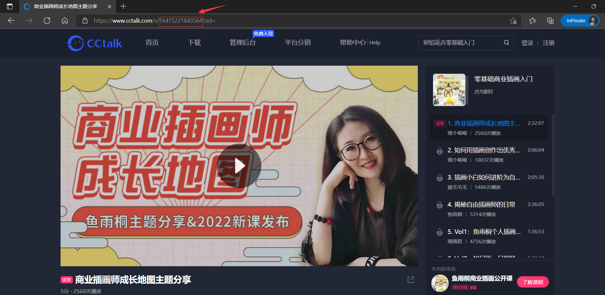
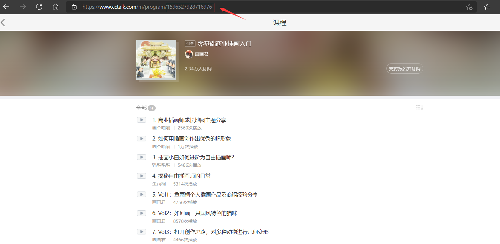
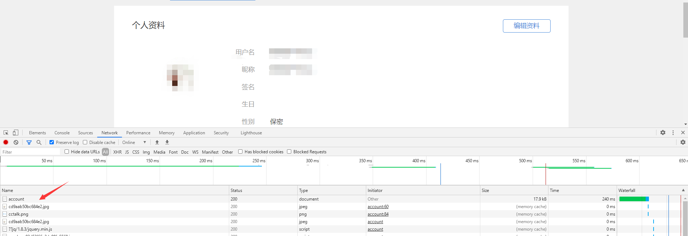
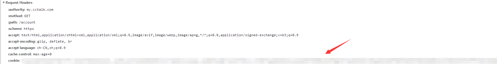
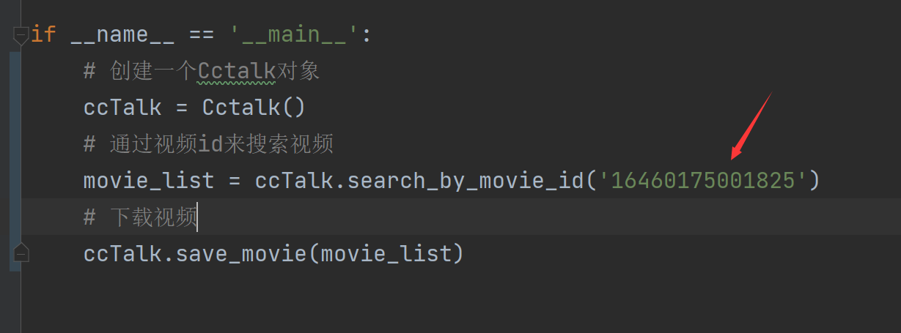
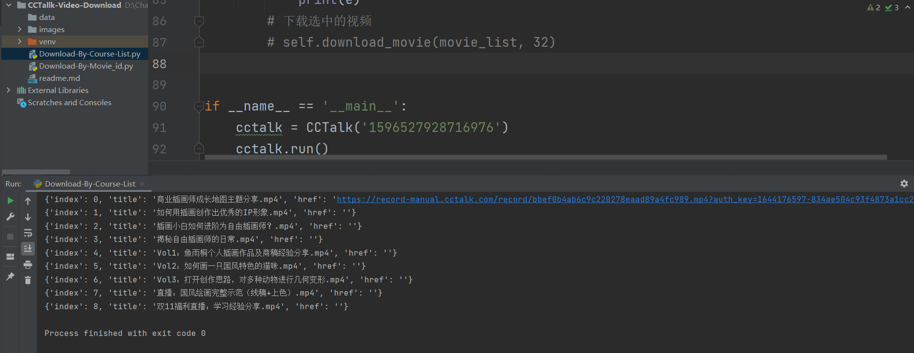
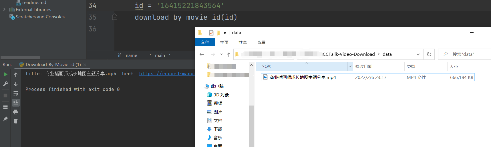

## 1. ABOUT CCTALK

CCtalk是沪江旗下的开放式教育平台，为各位老师提供完善的在线教育工具和平台能力，为求知者提供丰富的知识内容和一起学习的社群环境。 CC的含义是Content（内容）和Community（社区），横跨知识分享和在线教育两大领域。内容方面涵盖了语言类、职业教育、艺术、美术、兴趣、公考、IT培训等十几个品类，汇聚了数万名老师，利用平台的在线教学课堂，和世界各地的学生无界交流。学生们不再是自己孤独的学习，逐步融入以兴趣为核心的学习性社区。

CCtalk以其便捷多样的授课方式、强大的教学功能与营销工具、精准及时的老师后台服务， 吸引数万名老师入驻，进行互联网教学获取收益。

## 2. WHY TO WRITE THE PROGRAMMING

我接触 Cctalk 是因为曾经在这个平台上购买过课程，里面有一些老师讲的课还是不错的。在手机上，Cctalk也提供了视频下载功能。
电脑端没有下载过，基本是在浏览器观看的。这个项目并没有任何破解的成分，因为你能看到的，或者你已经购买过了的课程，才支持下载。（不支持下载cctalk版权保护的视频）。

## 3. HOW TO USE

#### 本程序是给程序员使用的，如果你没有相关的计算机基础，可能无法使用本程序。

- 下载的条件
  - 如果你是下载单个视频，只需要提供视频对应的id号即可。
    - 
  - 如果你要下载完整的课程，那么你要提供完整课程所对应的id号。
    - 程序自动对课程中的每个视频的id号进行提取。
    - 
    - 
  - 如果视频必须购买才能下载，那么你要事先登录Cctalk,并返回到**个人中心**，右键-点击**检查**--选择**network**-重新刷新网页-打开**account**，复制请求头里边的cookie的值。
    - 
    - 
    - 
  - 如果下载的是完整的课程，支持 选择性下载课程里任何多个视频。

## 4. DEMO

- 用户先要把本仓库下载到本地，之后通过 pycharm 打开
- 下载依赖的模块
- 该工程存在两个独立模块，不存在任何依赖关系。
  - 如果下载单个视频，请选择**Download-By-Movie_id.py**
  - 如果下载一个完整的课程序列，请选择**Download-By-Course-List.py**
- 只需要修改程序的里边的id即可
  - 如果是单个视频
    - 
  - 如果是一个完整的课程序列
    - 
- 下载的视频 保存在 该仓库的 data文件夹下，如果不存在该文件夹，需手动新建一个。否则，可能导致保存视频失败。

- 图片
  - 
  - 
  - 该图片不一定与实际运行的程序效果一致，因为未来一段时间随时会变化。

## 5. Supplementary Instruction

1. 不支持下载版权保护的视频。因为这个项目是基于从浏览器抓包分析后编写的。详细情况了解：[开启版权风险防控，加强视频内容安全-CCtalk](https://www.cctalk.com/faq/100175)